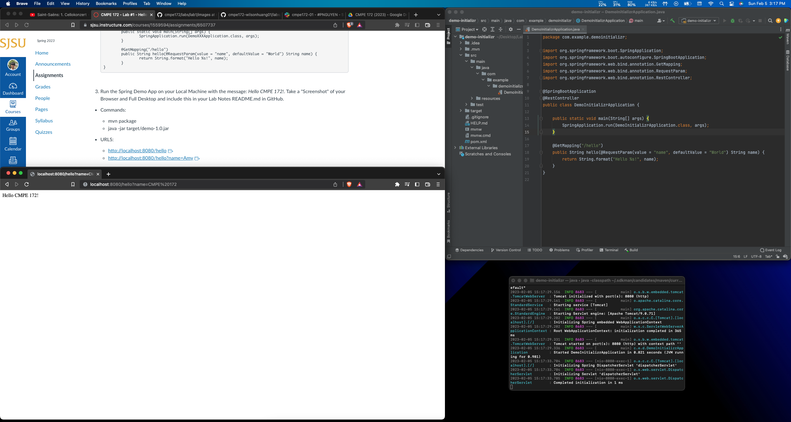
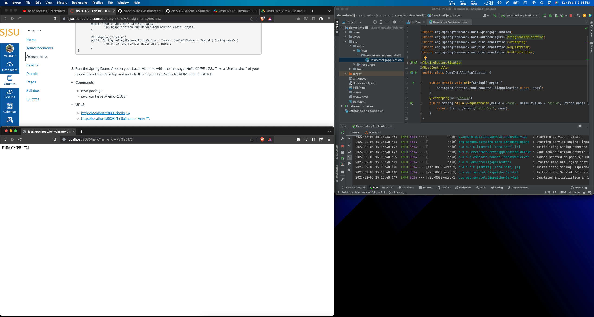
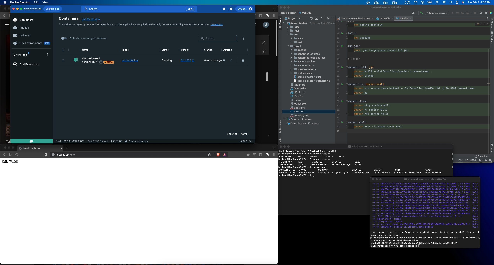

# CMPE 172 - Lab #1 Notes

## Spring Demo App Using Spring Initializr

Top right corner illustrates the IntelliJ IDE displaying the source code. A terminal was used to run the app (bottom right corner). A browser was used to visit the link and display the output (bottom left corner).

## Spring Demo App Using JetBrains IntelliJ IDEA

Top right corner illestrates the IntelliJ IDE displaying the source code. A built-in terminal in IntelliJ was used to run the app (right side). A browser was used to visit the link and display the output (bottom left corner).

## Spring Demo App Configured for Docker

Top right corner illustrates the IntelliJ IDE displaying the Makefile. A running container named demo-docker1 on port 80 can be seen inside Docker Desktop positioned in the top left corner. A browser was used to visit the link and display the output (bottom left corner), and 2 terminals were used to run the container and to check running containers on the machine.
