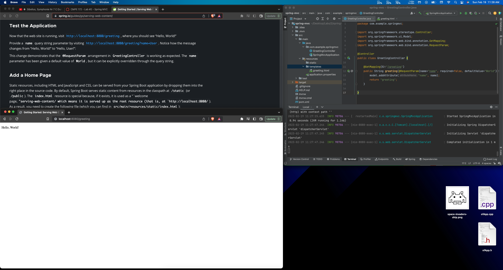
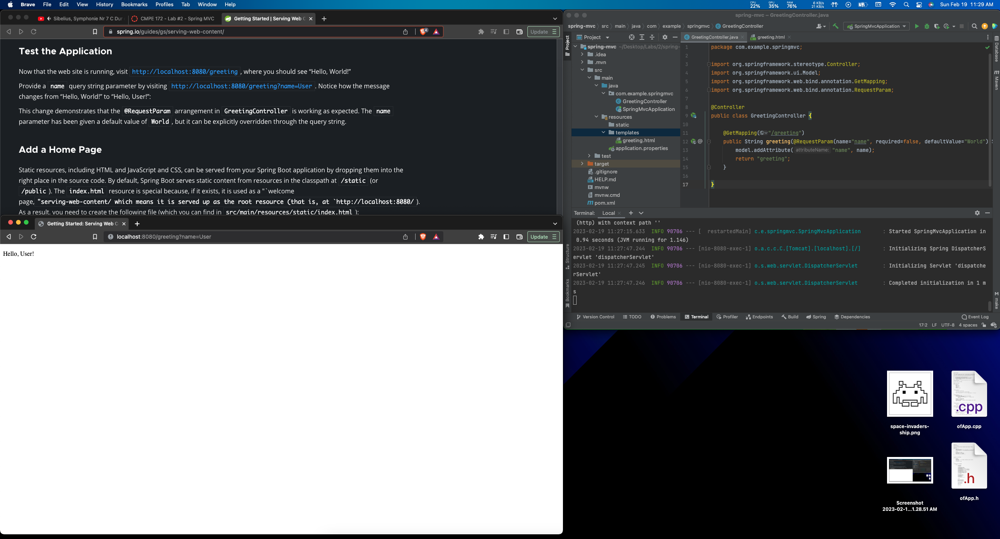
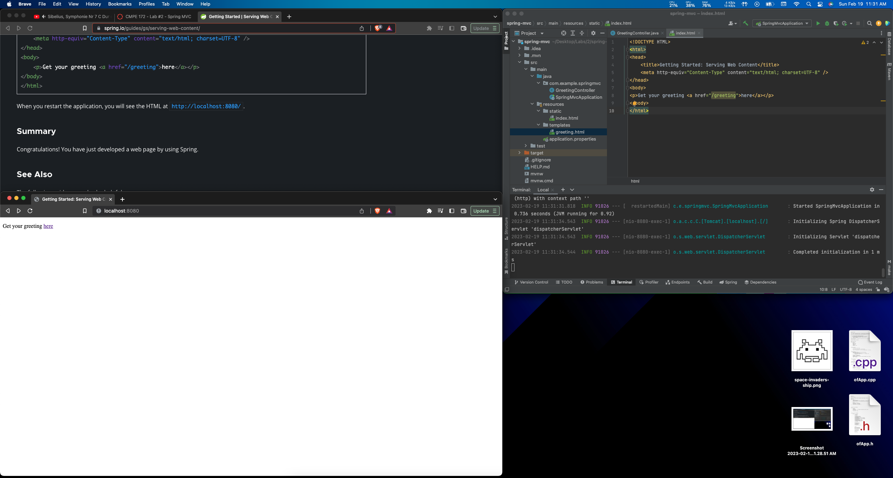
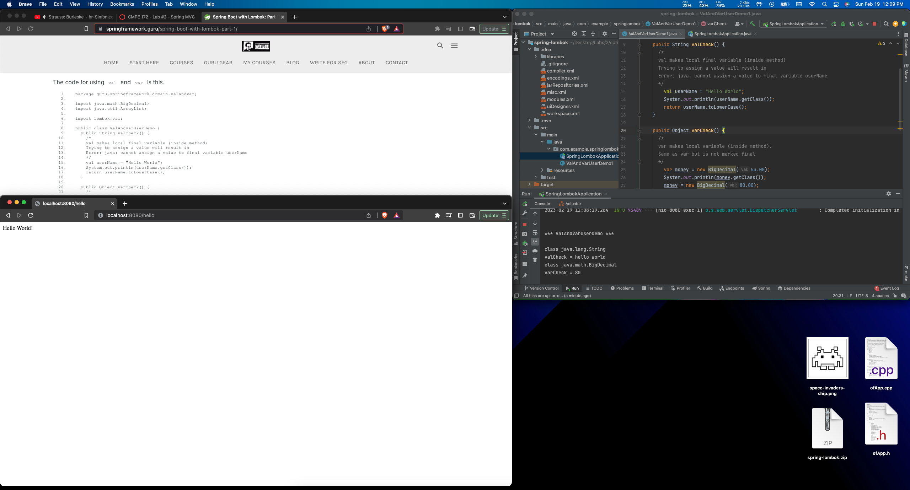
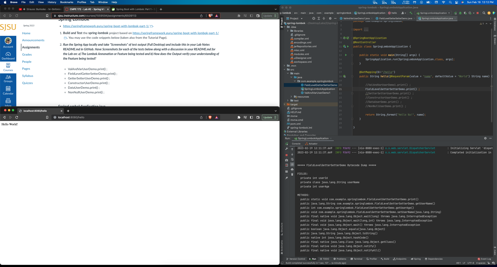
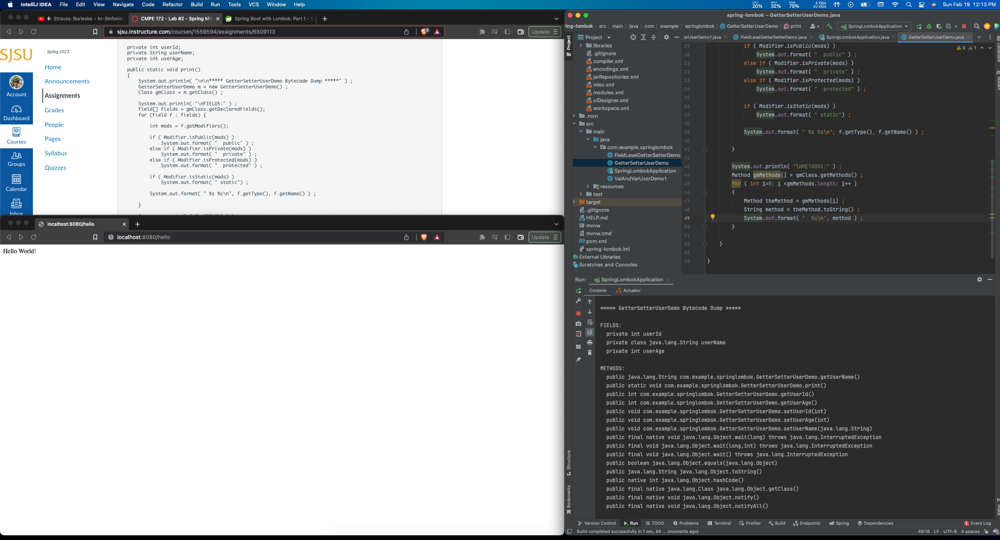
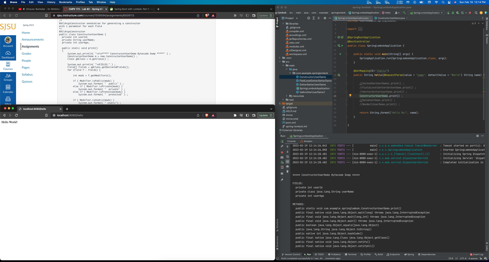
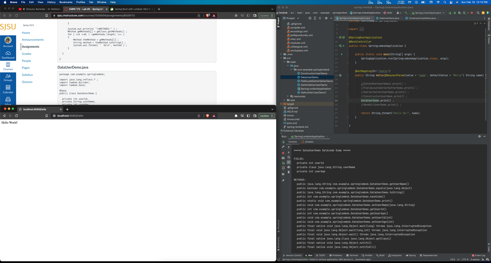
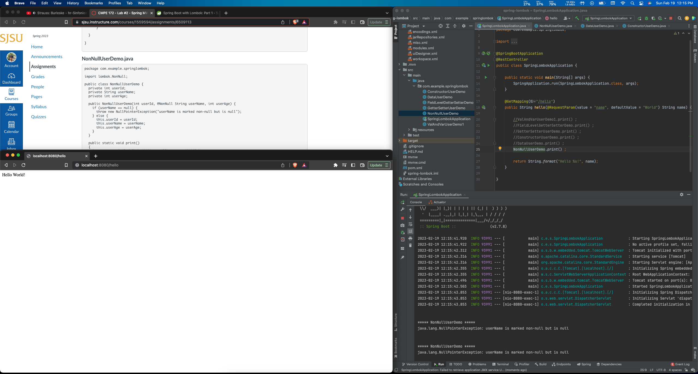

# CMPE 172 - Lab #2 Notes

## Spring MVC

Testing the application without the `name` query parameter. It displays "Hello, World!".

Testing the application with the `name` query parameter set to "User". It now displays "Hello, User!".

Adding a home page then testing the application.

## Spring Lombok

### ValAndVarUserDemo

The val `userName` is instantiated as a String so its class is java.lang.String. Because `money` is a var, its value can be changed.
Note: setting the name of the class to "ValAndVarUserDemo" caused a glitch in my IntelliJ IDE, so I changed it to "ValAndVarUserDemo1"

### FieldLevelGetterSetterDemo

`userName` is tagged with @Getter and @Setter so lombok generates both getUserName() and setUserName() for it. `userAge` is tagged with @Getter only, so lombok generates getUserAge() but not setUserAge(). `userId` is not tagged with anything, so lombok does not generate getter or setter for it.

### GetterSetterUserDemo

The entire GetterSetterUserDemo class is tagged with @Getter and @Setter, so lombok generates getter and setter for all three variables (`userId`, `userName`, and `userAge`).

### ConstructorUserDemo

The @NoArgsConstructor generates a constructor with no parameters and the @AllArgsConstructor generates a constructor with 1 parameter for each of its fields, so there is no need to write a constructor explicitly.

### DataUserDemo

The class is tagged with @Data so lombok generates getter and setter for all its variables (`userId`, `userName`, and `userAge`).

### NonNullUserDemo

The `userName` parameter is tagged with @NonNull so creating a NonNullUserDemo object with the `userName` set to null throws a NullPointerException.
