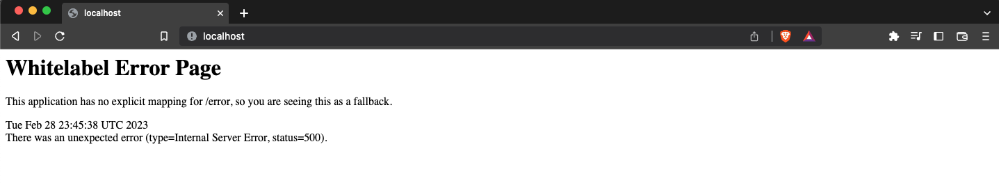

# CMPE 172 - Lab #3 Notes

## Deployment to Docker

Screenshot of Docker Desktop. 2 gumball containers are currently running, one has ID 8b110c668b63, and the other has ID 407e7075623f. A load balancer is also running, which has a ID of 59c9cd52b739.

Screenshot of the whole desktop. A webpage is connected to localhost:80.

## Gumball App
### Reloading the Page

When first loading the page, the Server Host/ID is 8b110c668b63/172.18.0.2, demonstrating that we are connected to one of the containers.

After reloading the page, the Server Host/ID becomes 407e7075623f/172.18.0.3, which shows that the load balancer is connecting us to the other container.

After reloading the page 1 more time, the Server Host/ID returns to 8b110c668b63/172.18.0.2, showing that the load balancer connects us back to the first container.

### IP Values
The IP values come from the container ID, as shown in the screenshot of Docker Desktop.

### Adding Quarters and Purchasing Gumballs

After clicking on the "Insert Quarter" button or the "Turn Crank" button, the page is now showing a Whitelabel Error.

### Error

The logs of the container that throws an error indicates a NullPointerException at line 69 in GumballMachineController.

Line 69 indicates that `gm` is Null, which can be traced back to line 66, where `session.getAttribute("gumball")` returns a Null.

### Cookies

In docker-compose.yaml, `COOKIES_ENABLED` is set to `false`, and this causes the load balancer to route traffic to a different container every time the page is loaded/reloaded.
Setting it to `true` can avoid the error because a session would stick to the same container even after reloading the page.

## Testing via Jumpbox

"curl localhost" in terminal to Docker's load balancer port.

"curl localhost:8080" in one of the spring-gumball containers, indicating that the container is up.

"curl 172.18.0.3:8080" in the Jumpbox, where "172.18.0.3" belongs to one of the spring-gumball containers.

"curl 172.18.0.2:8080" in the Jumpbox, where "172.18.0.2" belongs to the other spring-gumball container.
