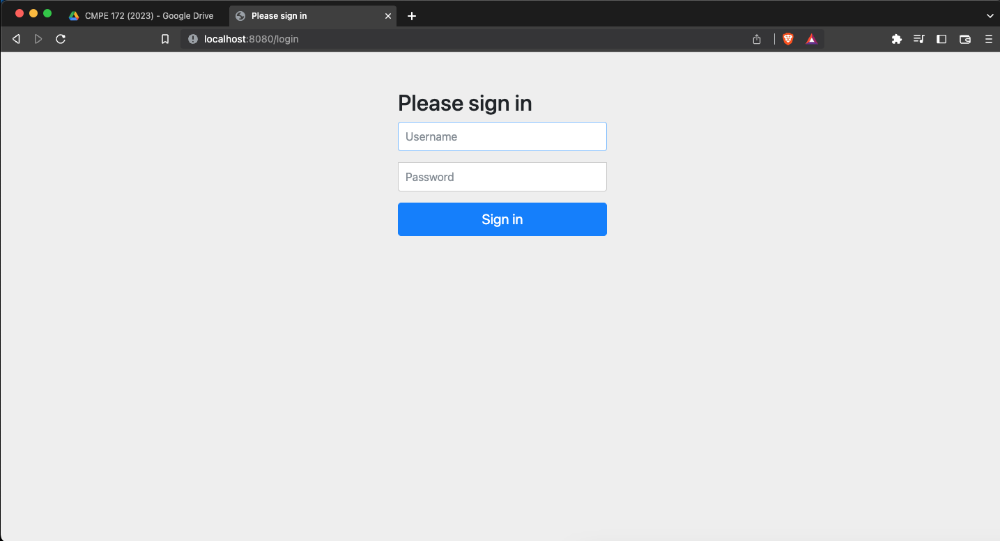
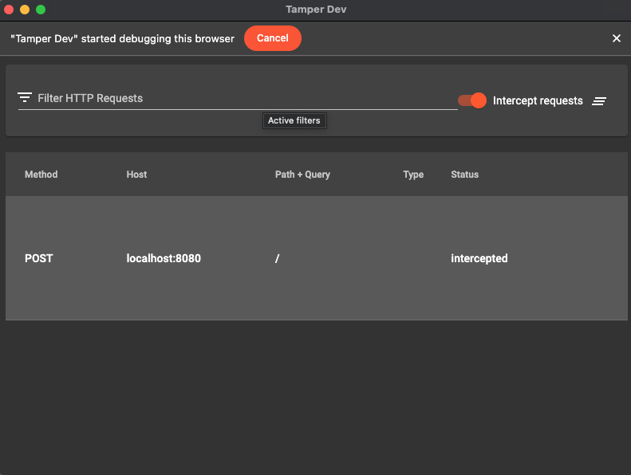

# CMPE 172 - Lab #4 Notes

## Spring Security

Visiting "/home" does not require logging in first.

However, visiting "/hello" requires us to log in, so the webpage
redirects to the "/login" page and prompts us to enter the
username and password.

After entering the username and password into the respective
fields and clicking on the "Sign in" button, it redirects us
back to the page we are requesting ("/hello").

## Spring Gumball v2

### Deployment

Deployment of Spring Gumball to Docker, which contains 2
gumball containers and a load balancer.

Typing "docker ps" into the terminal shows currently running
containers.

Server Host/IP rotates between "87d6fb090374/172.19.0.2" and
"f70334b1c3bc/172.19.0.3", demonstrating that the load balancer
is working.

### Session

Clicking on the "Insert Quarter" button causes Whitelabel Error.

Checking the logs of one of the spring-gumball reveals a
NullPointerException in GumballMachineController at line 70.

`gm` is null, which means that there is an error with the
session table. Making it stateless would fix the error.

### Replay Attack (Before)

Clicking on the "Turn Crank" button without inserting a
quarter first prints "You turned, but there's no quarter. 
You need to pay first" in the terminal.

To demonstrate a replay attack, we use the "Tamper Dev" Chrome
plugin to intercept and modify HTTP requests.

After toggling "Intercept requests" on and clicking on the
"Turn Crank" button, the request is intercepted.

We can modify the state of `Request body` from "NoQuarterState"
to "HasQuarterState" then send it.

The terminal prints "You turned... A gumball comes rolling
out the slot..." but we have not inserted a quarter, this
demonstrates a successful replay attack.

### Replay Attack (After)

Fixing the code and turning it stateless. Then open Tamper Dev
again to try intercepting requests.

Editing the `Request body` from "NoQuarterState" to
"HasQuarterState". Unlike the `Request body` from the previous
spring-gumball version, the new `Request body` now contains
additional parameters (timestamp, hash, and message).

Sending the modified request would cause a `GumballServerError`
because the change in timestamps is too large. This demonstrates
that a replay attack is thwarted.
