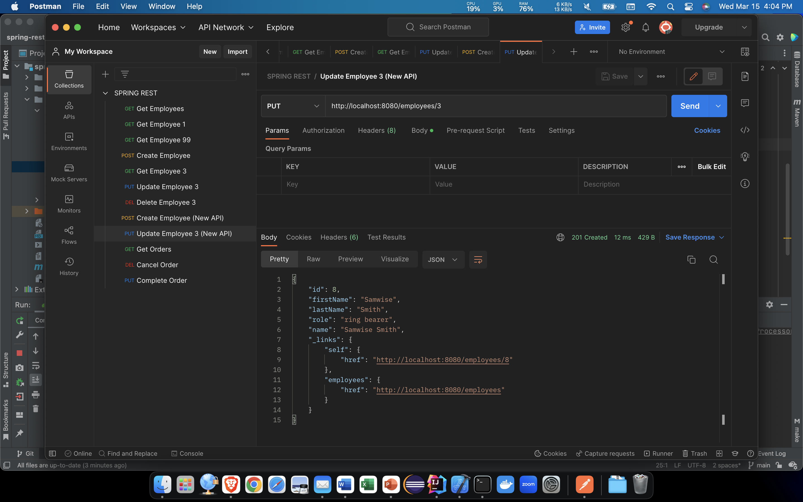
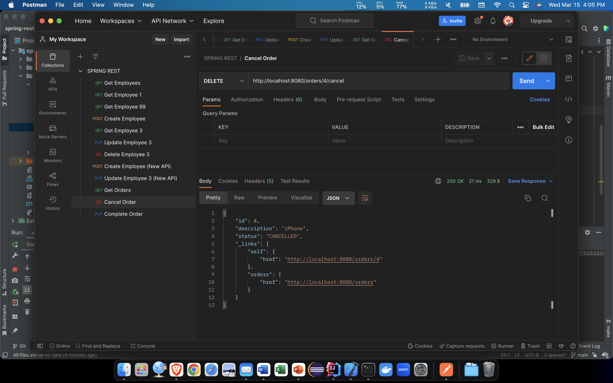

# CMPE 172 - Lab #5 Notes

## Spring Rest Level 2

"Get Employees" returns `id`, `name`, and `role` of each employee.

"Get Employee 1" returns the `Employee` that has `id` = 1.

"Get Employee 99" returns no result because there is no
employee that has `id` = 99.

"Create Employee" creates an `Employee` with the parameters
in `Body` of the request and returns that `Employee` as the
response.

"Get Employee 3" returns the `Employee` that was just created.

"Update Employee 3" updates the `Employee` that has `id` = 3
with parameters found in the `Body` of the request and returns
that `Employee`.

"Delete Employee 3" deletes the `Employee` that has `id` = 3.

"Create Employee" has the parameters `firstName` and `lastName`,
however, the database uses `name`, therefore the `name` in
the response is `null`.

"Update Employee" cannot find the `Employee` so it creates
a new `Employee` that has `role` set to "ring bearer".

`Order` has not yet been implemented so "Get Orders" returns
404 Not Found.

`Order` has not yet been implemented so "Cancel Orders" 
returns 404 Not Found.

`Order` has not yet been implemented so "Complete Orders"
returns 404 Not Found.

## Spring Rest Level 3

"Get Employees" returns a list of `Employee`s with `id`, 
`firstName`, `lastName`, `role`, `name`, and `_links`.

"Get Employee 1" returns the `Employee` that has `id` = 1.

"Get Employee 99" returns nothing because there is no
`Employee` with `id` = 99.

"Create Employee" creates an `Employee` with the provided
parameters. The `name` is split and used for `firstName`
and `lastName`, as implemented in the source code.

"Get Employee 3" returns nothing.

"Update Employee 3" cannot find the employee, so it
creates a new `Employee` instead.

"Delete Employee 3" returns 500 Internal Server Error.

"Create Employee" using `firstName` and `lastName`.

"Update Employee" cannot find the employee, so it
creates a new `Employee`.

"Get Orders" returns a list of orders.

"Cancel Order" cancels the `Order` with `id` = 4 and 
changes the `status` from "IN_PROGRESS" to "CANCELLED".

The `Order` with `id` = 4 has been cancelled, so it cannot
be completed.
