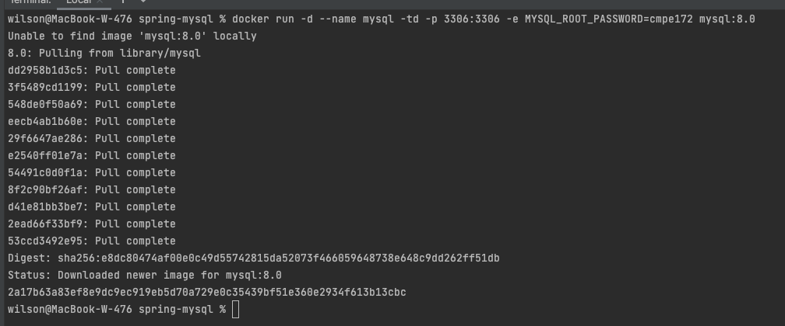
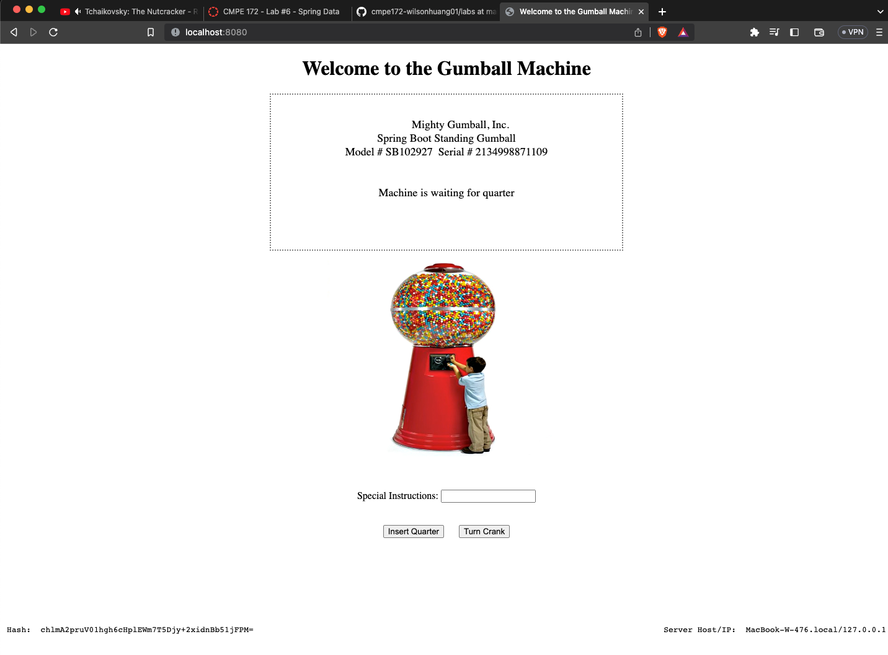

# CMPE 172 - Lab #6 Notes

## Spring JDBC

Full desktop view and console view.
Logger prints out operations on the database, 
e.g., "Creating tables" and "Inserting customer
record for Jeff Dean".

## Spring MySQL

Full desktop view and console view showing MySQL
running in Docker.

A `user` table is created. MySQL Workbench is used
to view the database.

Adding a user where `name` = "First" and `email` = 
"someemail@someemailprovider.com".

Getting users from the database returns all users in
the database. In this case, it returns only 1 user.

## Spring Gumball v3

2 containers are currently running in Docker - mysql
and spring-gumball.

Webpage shows the `Model`, `Serial`, `Hash`, etc.

HTML source shows hidden fields.

Commands to create MySQL and Gumball containers.

Before purchasing a gumball, 1000 in stock.

After purchasing a gumball, gumballs in stock decrease to 999.

