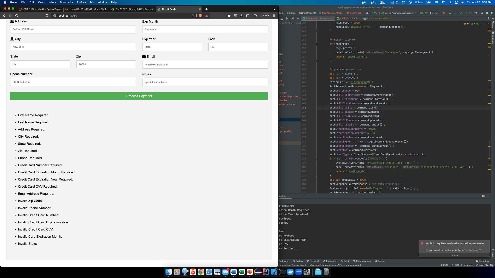
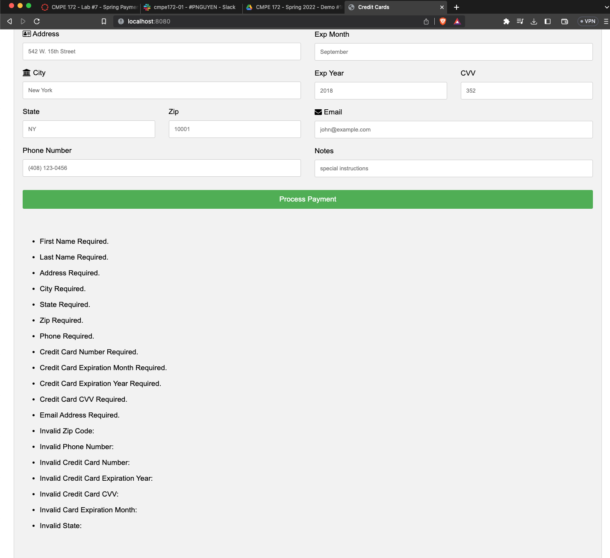
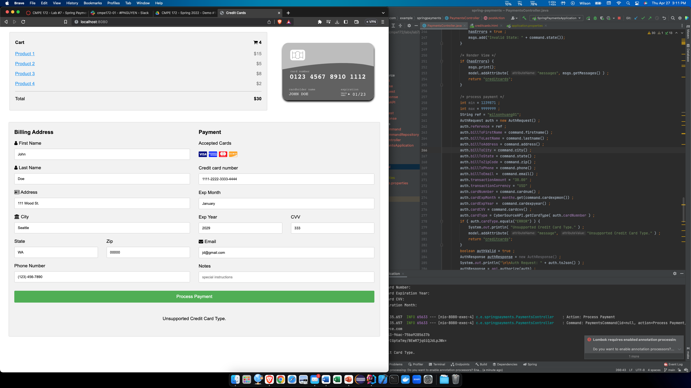
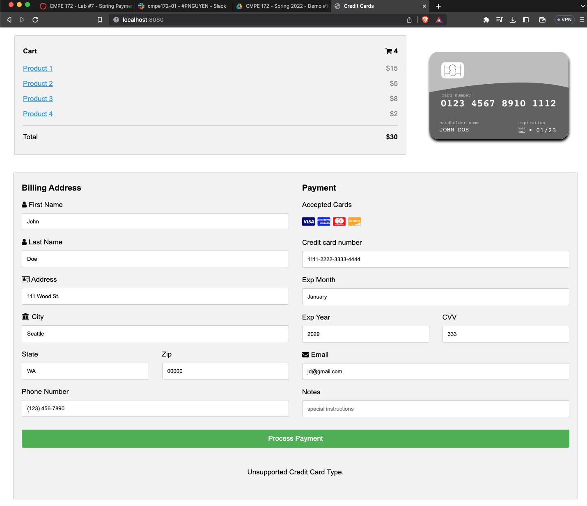
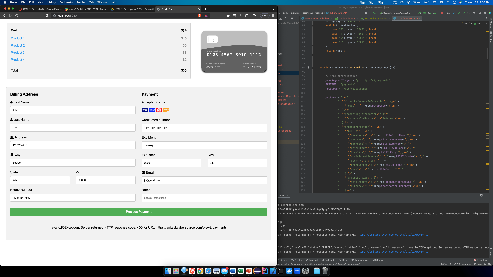
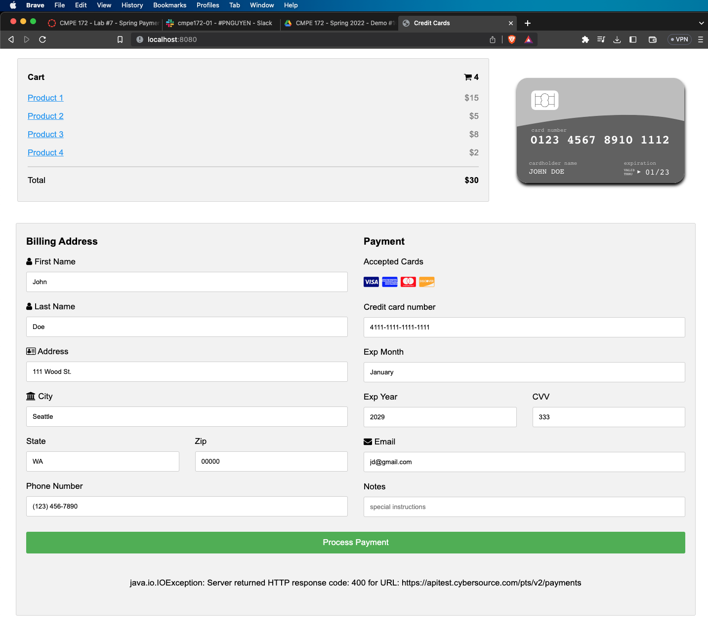

# CMPE 172 - Lab #7 Notes

## Spring Payments

Sample Payment Screen outputs.

## Discussion

### Lombok

Lombok annotations were used to generate methods
like getters and setters in PaymentsCommand.java.

### Thymeleaf

Thymeleaf was used for the html view template. It
includes directives such as href, object, field, and
text.

### Spring

Some Spring features used in this lab include 
Spring JPA and Spring Web.

### Jackson

Jackson is a JSON processor that can translates Java
objects to JSON and JSON to Java objects. It was used
in response files (e.g. AuthReponse and CaptureResponse)
and Payload.java.