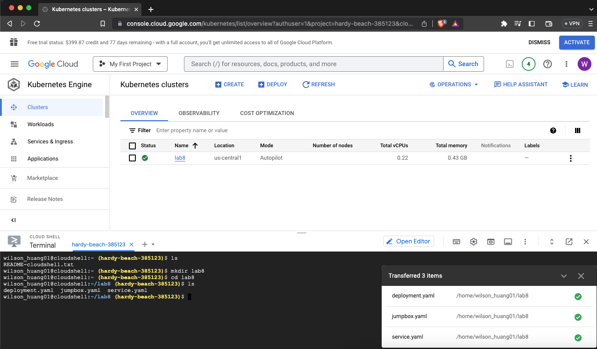
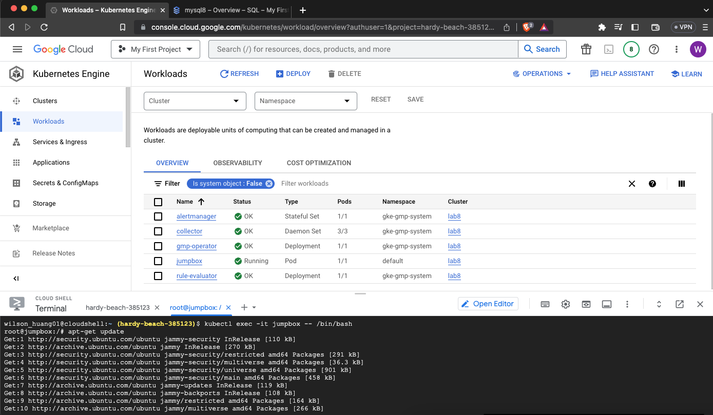
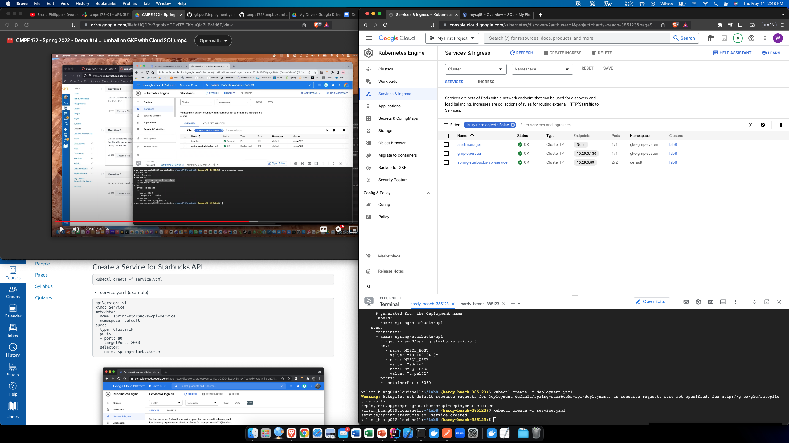
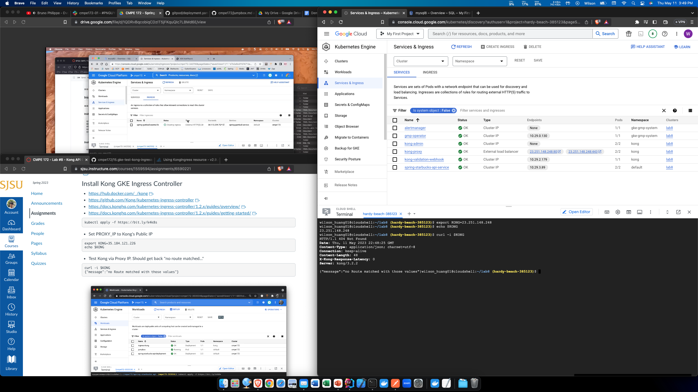
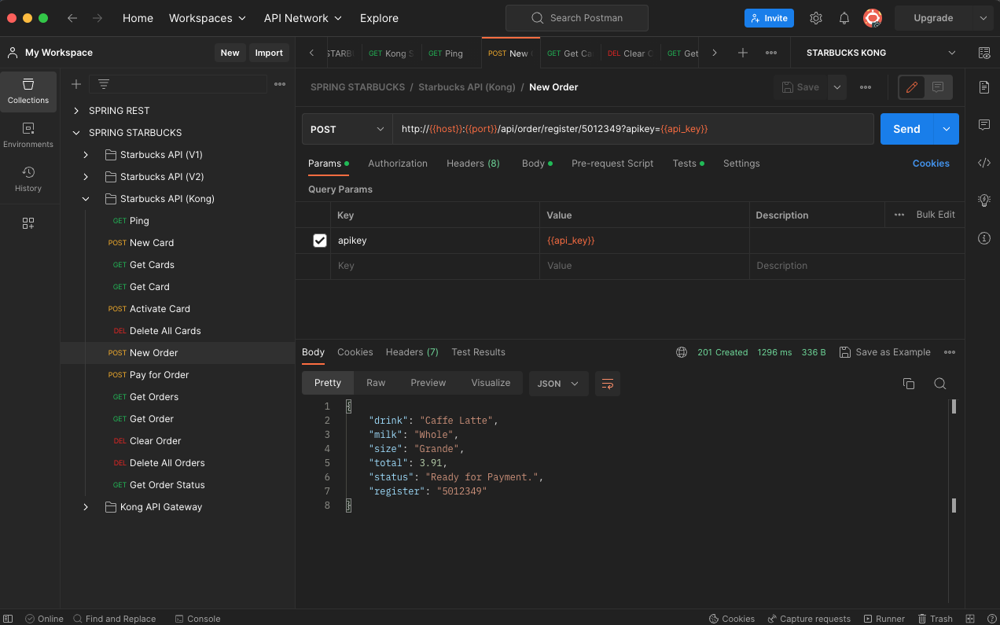

# CMPE 172 - Lab #8 Notes

## Install Kong on Local Docker

### Create Kong Docker Network

### Run Starbucks API in Docker

### Run Kong in Docker

## Deploy on Google GKE

### Build and Push Starbucks API

### Create a Cluster

### Connect Cloud Shell Terminal to Cluster

### Create MySQL Database

### Test MySQL Database from Jumpbox

### Deploy Starbucks API

### Create a Service for Starbucks API

### Test Reachability from Jumpbox

### Install Kong

### Configure Kong's IP

### Create an Ingress Rule to Proxy the Starbucks Service

### Test Kong API Ping Endpoint

### Add Kong Key-Auth Plugin

### Configure an API Client Key

### Create Kubernetes Secret and Apply API Key Credentials to API Client

### Test Starbucks API Against Kong via Public IP of Load Balancer

## Test Starbucks API from Postman

## Discussion

### Challenges

One challenge I faced was that the kong-ingress-rule.yaml
provided in the assignment page uses a deprecated API 
and it caused errors when I tried to deploy it on GKE.
I solved this issue by looking at the documentation page,
which has an example yaml file. I modified the
kong-ingress-rule.yaml file to have similar structure as
the one listed on the documentation page.

### MySQL

My Starbucks API image uses MySQL so I created a new
MySQL instance on Google Cloud. Then I took the instance's
IP address and paste it into deployment.yaml.
