# CMPE 172 - Lab #9 Notes

## RabbitMQ

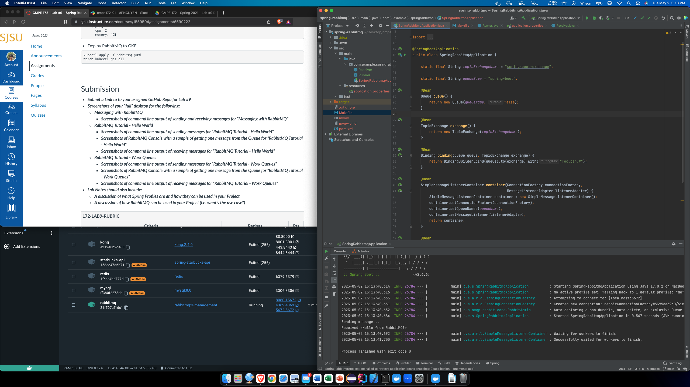
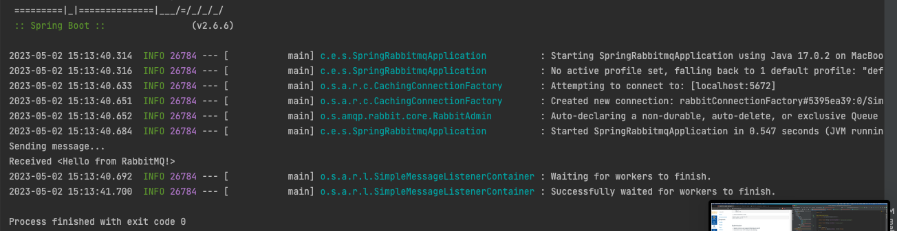

## RabbitMQ - Hello World

### Sender

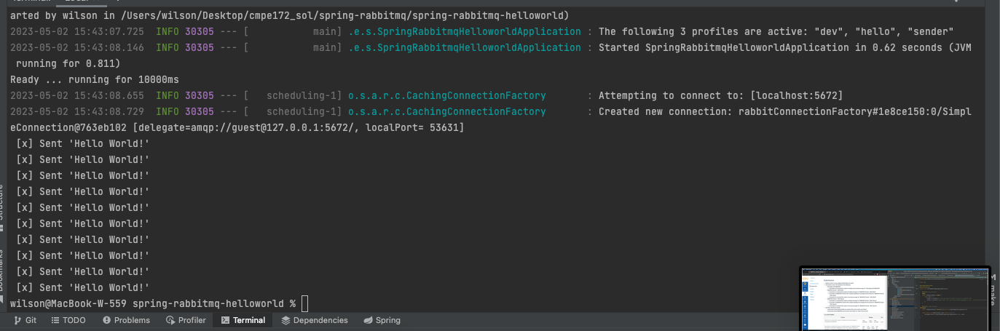

### Console

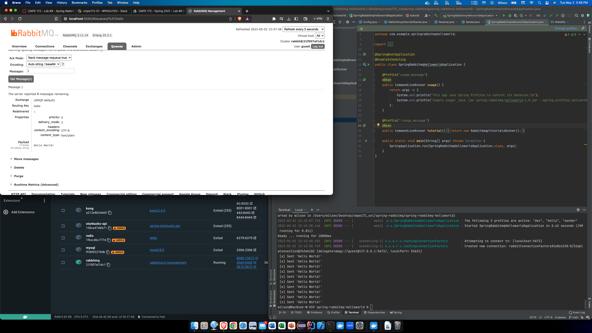

### Receiver

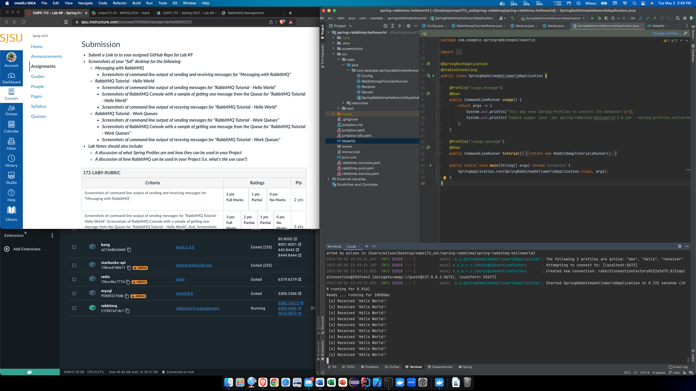
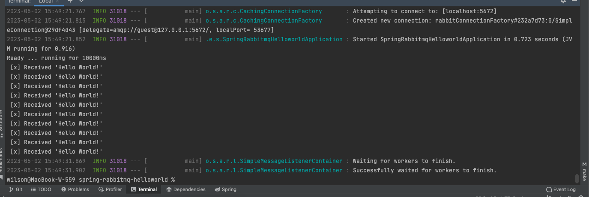

## RabbitMQ - Work Queues

### Sender

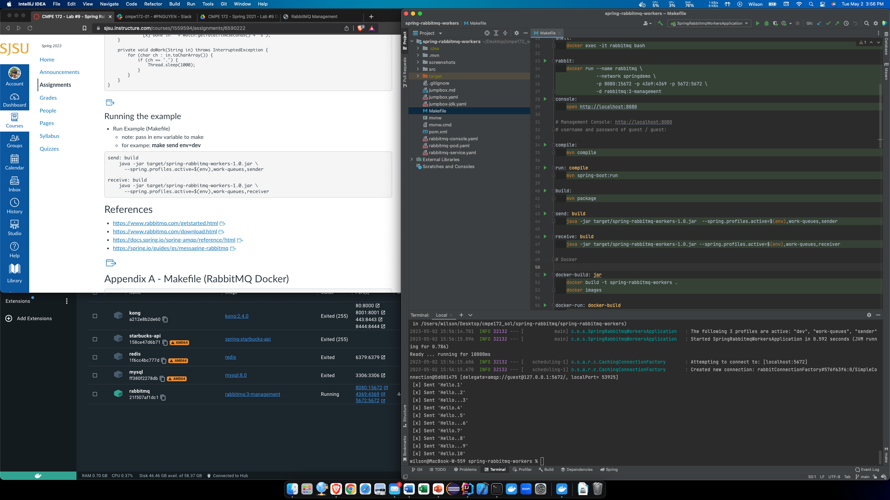
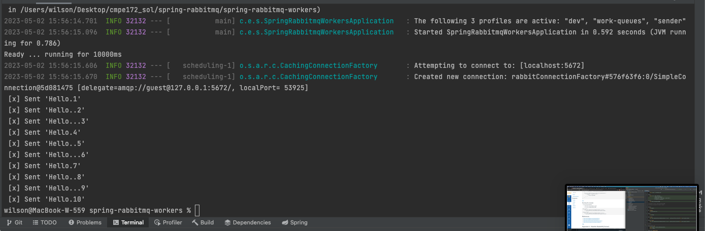

### Console

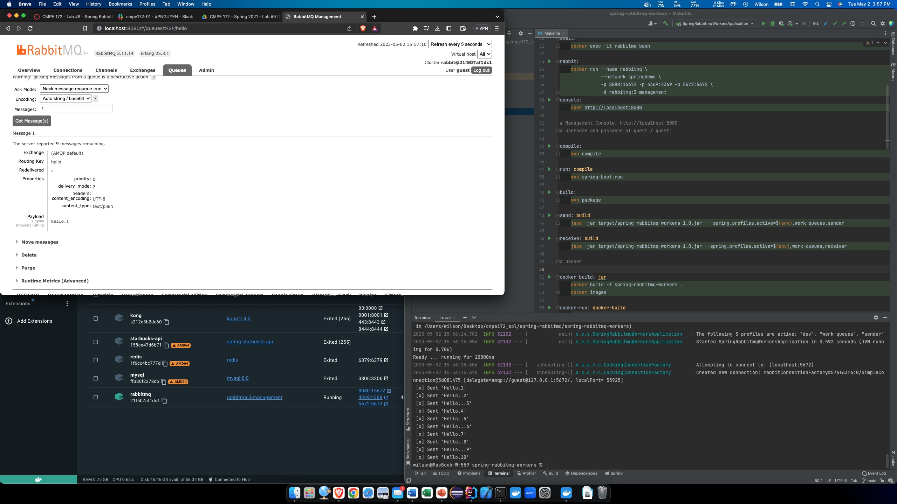
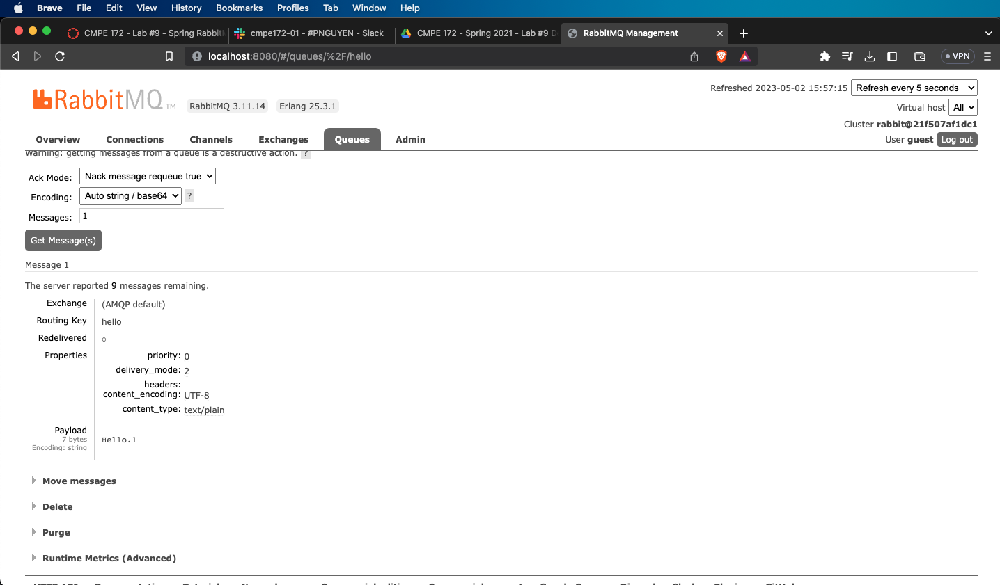

### Receiver

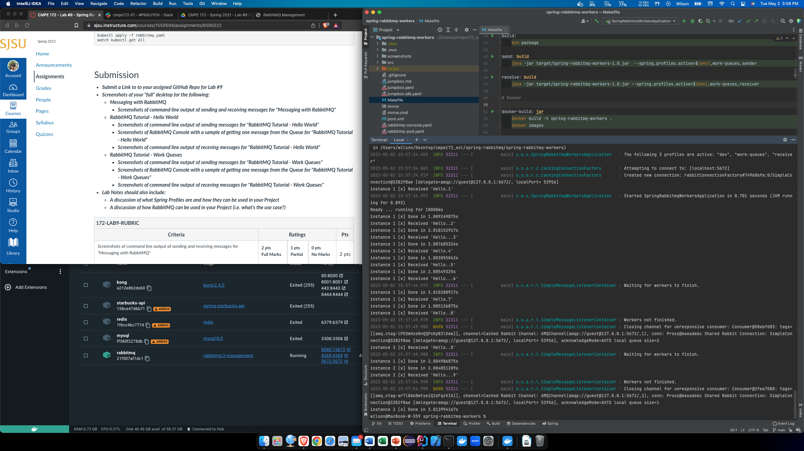
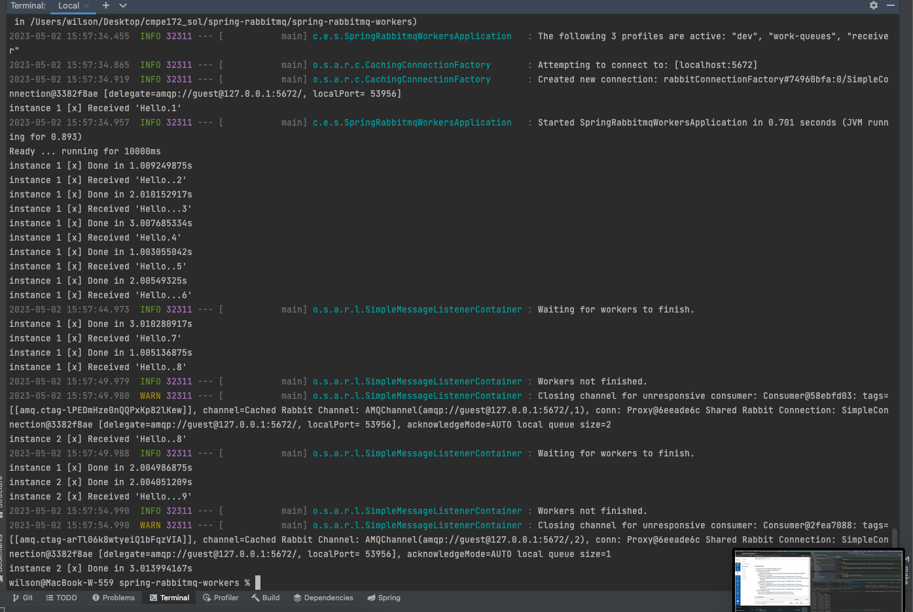

## Discussion

### Spring Profiles

Spring profiles are sets of Spring Properties that can be
applied to the project in different phases. (Ex. 
application-dev.properties for development and 
application-prod.properties for production.) Use these profiles
to configure the project.

### RabbitMQ

RabbitMQ can be used for async messaging. A sender can send
a message to a queue and a receiver can receive it later on 
when needed.
