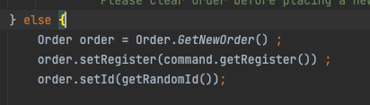
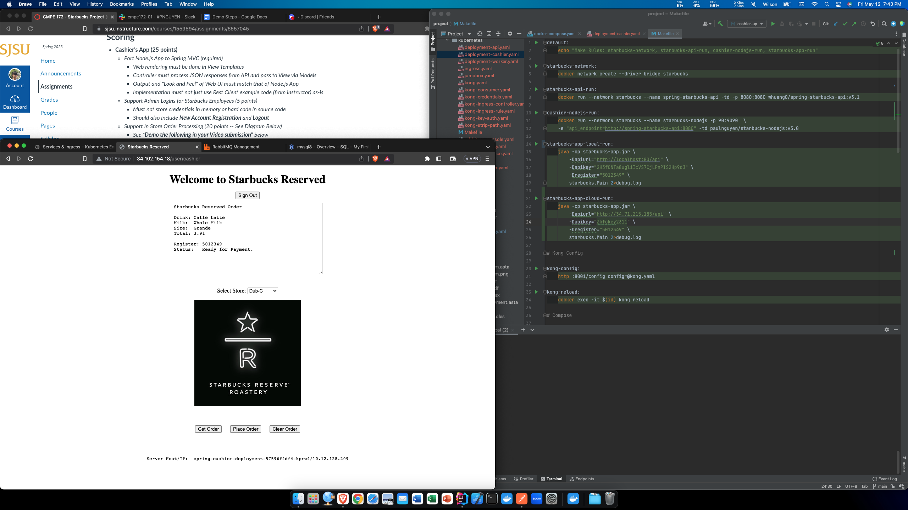
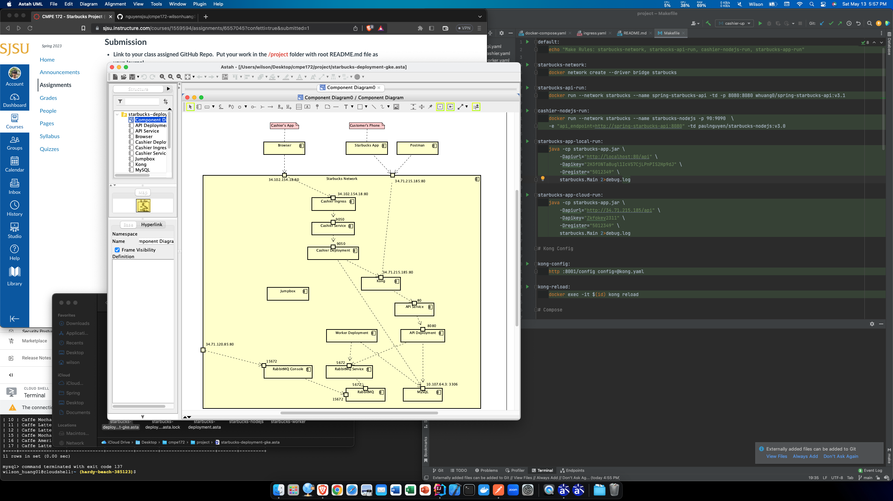
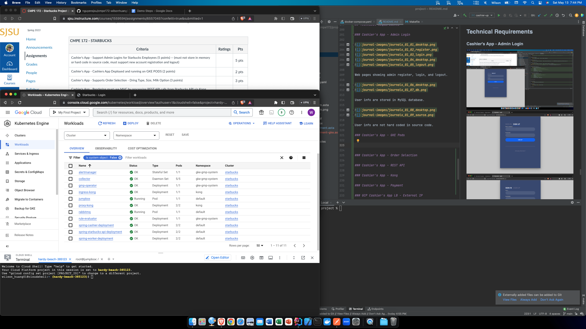
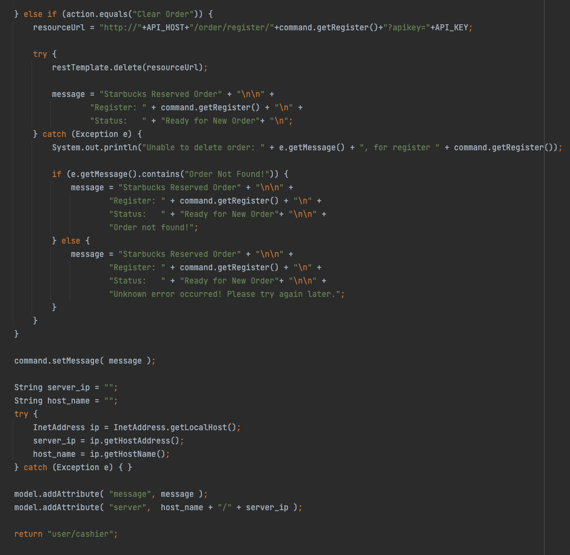
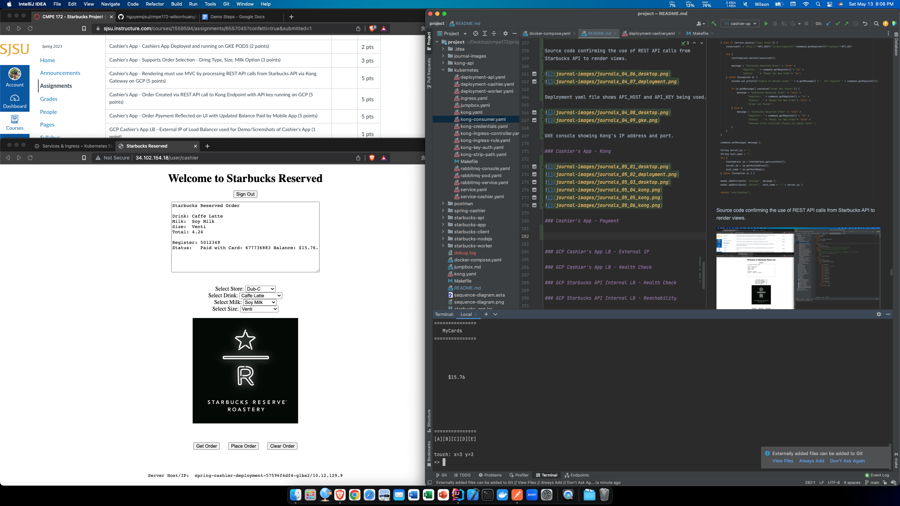
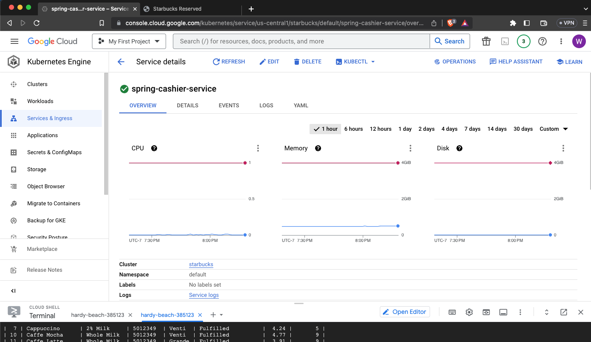
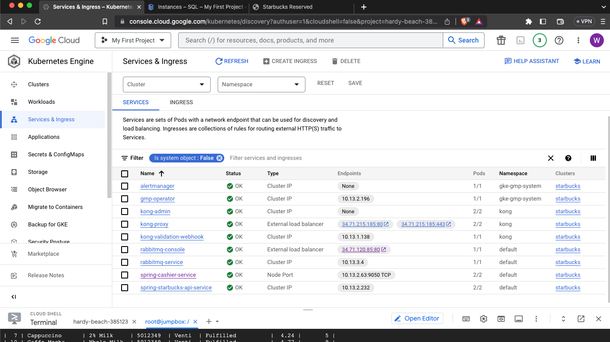

# CMPE 172 Project Journal

## Journal #1 - Mar 26

Pulled source codes and files from gitpod repository.
Made changes to SpringCashierController.java and starbucks.html to display message in textarea.

Link: https://github.com/nguyensjsu/cmpe172-wilsonhuang01/commit/f6732feed9dc0fa5f2ab23de8cf7acc7820d9c61

## Journal #2 - April 23

Updated cashier to use implementation from the midterm.
Cashier now displays the active order of the register
and its status.

Cashier is currently using MySQL to store information
about orders and active orders, which can be queried
by using the 'select' command.

Link: https://github.com/nguyensjsu/cmpe172-wilsonhuang01/commit/6099b74b850c88b29b462d8c48332ef1a8dde077

## Journal #3 - April 25

Updated the controller for Place Order.
The implementation now checks if an active order is
already present for the register. If an active order
exists, it tells the user to clear the order first
before placing a new order.

Link: https://github.com/nguyensjsu/cmpe172-wilsonhuang01/commit/65a951a183c42b27b96d1c6d92f7c1b7693db6d3

## Journal #4 - April 26

Updated order id generation method to use Math.random()
instead of Order.hashCode(). This fixes the issue where
identical orders would have the same hashCode.

Link: https://github.com/nguyensjsu/cmpe172-wilsonhuang01/commit/6163b7543ab31ee6eded09736f9b26fab3e888dc

## Journal #5 - May 5

Updated spring-cashier to use Kong API instead of
storing orders in MySQL.

The code currently does not handle the error when
"Get Order" is called when there is no active order
at the register. The API returns error code 400: 
Order not found.

The code currently does not handle the error when
"Place Order" is called when an active order for the
register already exists. The API returns error code
400: Active order exists.

The code also does not handle the error when
"Delete Order" is called when there is no active order
at the register. The API returns error code 400: 
Order not found.

Some sort of error handling is required to handle
the error and properly render the view.

Link: https://github.com/nguyensjsu/cmpe172-wilsonhuang01/commit/38178b346ad45c61f01ac7ea7fe49b162ae8b72e

## Journal #6 - May 6

Implemented HTTP error code handling for "Get Order", 
"Place Order", and "Delete Order". Currently working
on the functionality for registering new account 
and logging out.

Link: https://github.com/nguyensjsu/cmpe172-wilsonhuang01/commit/4cd203bf67ccc4a294f047adac573e2232054cc3

## Journal #7 - May 7

Implemented Request API to put Order request in a
RabbitMQ Queue. Also implemented Check Order Status
API to check the status of a Starbucks Order. 

Implemented Background Worker Job to pick up Orders
and make Drinks. Once a drink has been made, the 
Order's status changes to "Fulfilled".

Links:

https://github.com/nguyensjsu/cmpe172-wilsonhuang01/commit/0811dea670b9ed6897d5bce7a55132ff1ef06a8c
https://github.com/nguyensjsu/cmpe172-wilsonhuang01/commit/3a09e3a93a5cb9ca545e60aae35801dc674234cd
https://github.com/nguyensjsu/cmpe172-wilsonhuang01/commit/842bcf49c5987c9d1144f37d081aa85a41f95053

## Journal #8 - May 9

Added new account registration page and changed the login
page. Registration page shows "User already registered" if
the email has already been used. Login page shows
"Invalid username and password" if either username or
password is wrong.

Added a Logout button in the cashier page that logs the 
user out when the user clicks on it.

Link: https://github.com/nguyensjsu/cmpe172-wilsonhuang01/commit/c475e7330e9b74dbe1bee6186cb88508ad3ef1f8

## Journal #9 - May 12

Added yaml files to deploy the project on Google Cloud.
Pods, services, and ingress are running without errors.

In store order processing works properly using URL used
by the app deployed on Google Kubernetes Engine.

Link: https://github.com/nguyensjsu/cmpe172-wilsonhuang01/commit/36f2abfa1780c5c48683485609b081ece36d3e52

## Journal #10 - May 13

Added order customization. 

Link: https://github.com/nguyensjsu/cmpe172-wilsonhuang01/commit/f2d2a81f8c877932ae6dceee4cff7b0f6e079082

## Architecture Diagrams

### Docker

### GKE

## Technical Requirements

### Cashier's App - Admin Login

Web pages showing admin register, login, and logout.

User info are stored in MySQL database.

User info are not hard coded in source code.

### Cashier's App - GKE Pods

Cashier's app are deployed and running on GKE pods.

### Cashier's App - Order Selection

The "Place Order" button places an order that corresponds 
to the selections.

Order is stored in MySQL database.

API call using Postman confirms order placed.

### Cashier's App - REST API

Source code confirming the use of REST API calls from 
Starbucks API to render views.

Deployment yaml file shows API_HOST and API_KEY being used.

GKE console showing Kong's IP address and port.

### Cashier's App - Kong

### Cashier's App - Payment

### GCP Cashier's App LB - External IP

### GCP Cashier's App LB - Health Check

### GCP Starbucks API Internal LB - Health Check

### GCP Starbucks API Internal LB - Reachability

### MySQL Cloud SQL - MySQL Instance

### MySQL Cloud SQL - MySQL IP

### MySQL Cloud SQL - Correspondence

### RabbitMQ - Deployment

### RabbitMQ - Functionality

Before payment.

After payment.

Logs.

### Kong Connection - Mobile App

### Kong Connection - Cashier's App

### Kong API Auth - API Key Auth

